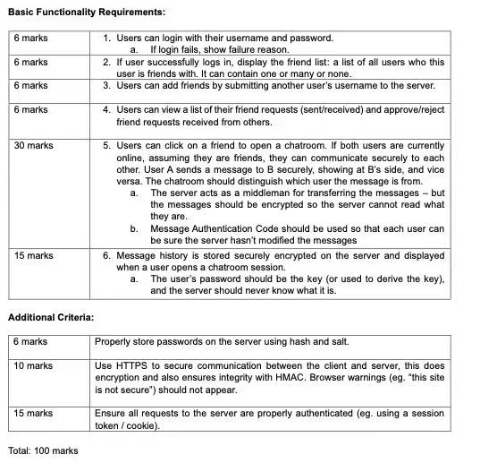

# Dev Log

Certain libraries required by the project lack support in Python 3.12. The project was developed using Python 3.11.8.

## Design Overview

Our project's development consistently aims to minimize alterations to the existing framework.

### Friends

The key design of the friends feature is the utilization of SQLAlchemy's ORM framework. We crafted tables for friendships and pending friend requests, employing a many-to-many self-referential relationship schema. This approach streamlines querying and managing friendships. However, given the intricacies of SQLAlchemy 2's syntax, we opted for a unidirectional design for the friendship table.

**Implemetation Details**:

1. Design of relational database tables for users, friendships, and pending friend requests.
2. Integration of a user interface to showcase friends and pending friend requests, leveraging Flask's Jinja2 templating engine.
3. Creation of an input field and JavaScript functionality to initiate friend requests.
4. Implementation of buttons and JavaScript for accepting or declining friend requests.
5. Development of backend routes and database operations to process friend requests.
6. Incorporation of validation checks during the process of adding friends to the database.
7. Addition of JavaScript enabling users to initiate chats by clicking on a friend's name.

### Chat

The chat feature is designed to be **end-to-end encrypted and verified**, mandating that all encryption and decryption occur on the **client-side**. We employed the Web Crypto API for this purpose.

Symmetric encryption is adept at encrypting and decrypting vast data volumes but is susceptible to **man-in-the-middle attacks** during key exchange. Although asymmetric encryption also necessitates a secure public key exchange, it can leverage a **Certificate Authority (CA)** to authenticate the public key.

In this project, we assume the server's reliability in transmitting public keys. For enhanced security, employing a CA to authenticate the public key or using **a pre-established secure channel** (e.g., in-person) for key exchange could be considered, though these are beyond our project's scope.

We opted against hybrid encryption, finding asymmetric encryption sufficiently efficient for real-time text chat on contemporary computers, with no noticeable delay in our encryption and decryption tests.

**Implemetation Details**:

1. Generation of RSA key pairs upon registration.
2. Storage and retrieval of public keys in the database.
3. Storage of public and private keys in the browser's local storage.
4. Encryption and decryption of messages.
5. Signing and verification of messages.
6. Display of messages in the chat window.

### History

The history feature is crafted to archive chat conversations in a database, ensuring the server cannot decipher the messages. Although utilizing users' passwords as the encryption key is a logical approach, we opt for the user's public key for encryption. This choice stems from several key factors:

1. The user's original password is transmitted to the server during registration and login.
2. The incoming messages are already secured with the user's public key, making the encryption of outgoing messages with the user's public key a coherent strategy.

**Implementation Details**:

1. Creation of a relational database table for chat conversations.
2. Archiving and fetching chat conversations from the database.
3. Encrypting outgoing messages using the user's public key.
4. Refreshing the history upon sending and receiving messages.
5. Displaying the chat history upon entering a chat session.
